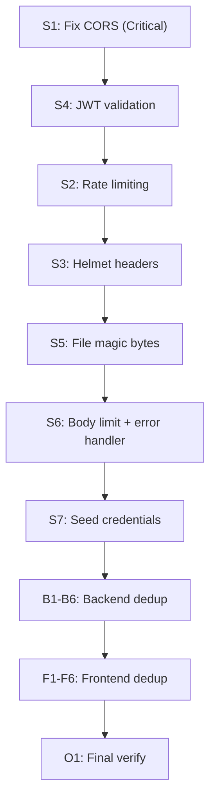

# Code Deduplication, Optimization and Restructuring

## Backend Deduplication

### B1: Extract shared Multer config to `server/src/lib/upload.ts`

The same 11-line Multer configuration is copy-pasted in 3 route files (`gallery.routes.ts`, `faculty.routes.ts`, `results.routes.ts`). Extract to a single shared module.

```typescript
// server/src/lib/upload.ts
export const imageUpload = multer({
  storage: multer.memoryStorage(),
  limits: { fileSize: 10 * 1024 * 1024 },
  fileFilter: (_req, file, cb) => { /* ... */ },
});
```

All 3 route files import from `lib/upload.ts` instead of defining their own.

### B2: Extract S3 upload helpers with consistent error handling

Two different S3 upload patterns exist: gallery fails hard, faculty/results silently skip. Create two reusable helpers in [server/src/lib/s3.ts](server/src/lib/s3.ts):

- `tryUploadToS3(file, folder)` -- returns `{ photoUrl, photoKey }` or `null` on failure (log + continue)
- `requireUploadToS3(file, folder)` -- throws on failure (for gallery where file is mandatory)

Also fix PUT routes where `deleteFromS3` then `uploadToS3` has no inner try/catch -- if upload fails after delete, old file is gone. Wrap in transaction-like pattern: upload first, then delete old.

### B3: Extract pagination parser to `server/src/lib/pagination.ts`

Same `parseInt(req.query.page) || 1` + `Math.min(parseInt(req.query.limit) || 20, 50)` + `skip/take` logic in `results.routes.ts` and `contact.routes.ts`. Extract:

```typescript
// server/src/lib/pagination.ts
export function parsePagination(query: any, defaultLimit = 20) {
  const page = parseInt(query.page) || 1;
  const limit = Math.min(parseInt(query.limit) || defaultLimit, 50);
  return { page, limit, skip: (page - 1) * limit };
}
```

### B4: Fix CORS security bug in `server/src/index.ts`

Both branches of the CORS `origin` callback return `true`, making CORS effectively open to all origins. Fix to actually reject non-whitelisted origins.

### B5: Fix Prisma client production caching in `server/src/lib/prisma.ts`

Current code only stores on `globalThis` in non-production. In Lambda/serverless production, this can cause excessive client instances. Store in production too.

### B6: Add database indexes to `server/prisma/schema.prisma`

No `@@index` directives exist. Add indexes for frequently filtered/sorted columns:

- **GalleryImage**: `@@index([isActive, date])`, `@@index([category])`
- **FacultyMember**: `@@index([isActive, displayOrder])`, `@@index([designation])`
- **StudentResult**: `@@index([year, board, isActive, percentage])` (covers the main query)
- **ContactMessage**: `@@index([createdAt])`

---

## Frontend Deduplication

### F1: Extract `ImageFallbackService` for `failedImages` + `showPhoto` + `onImgError`

The same `Set<string>` + `onImgError(id)` + `showPhoto(id, url)` pattern is duplicated in 3 components: [faculty.component.ts](src/app/faculty/faculty.component.ts), [board-results.component.ts](src/app/board-results/board-results.component.ts), [admin.component.ts](src/app/admin/admin.component.ts).

Create `src/app/shared/image-fallback.service.ts`:

```typescript
@Injectable({ providedIn: 'root' })
export class ImageFallbackService {
  private failed = new Set<string>();
  onError(id: string) { this.failed.add(id); }
  showPhoto(id: string, url?: string | null) { return !!url && !this.failed.has(id); }
}
```

All 3 components inject this service instead of duplicating the logic.

### F2: Move pagination + spinner + empty-state CSS to global `styles.css`

These CSS blocks are copy-pasted across 5+ component CSS files:

- `.pagination` + `.page-btn` (5 files: faculty, gallery, moments, video-gallery, board-results)
- `.spinner` + `@keyframes spin` (4 files)
- `.empty-icon` + `.empty-title` + `.empty-text` (3 files)
- `.filter-btn` active pill style (2 files)

Move them to [src/styles.css](src/styles.css) as global utility classes. Remove from each component CSS file.

### F3: Extract `PaginatedResponse` shared interface

`PaginatedResults` and `PaginatedMessages` are identical interfaces (`data`, `total`, `page`, `totalPages`). Create one generic:

```typescript
// src/app/shared/api.types.ts
export interface PaginatedResponse<T> { data: T[]; total: number; page: number; totalPages: number; }
```

Use in both `results-api.service.ts` and `contact-api.service.ts`.

### F4: Extract admin pagination helper

`visibleGalleryPages`, `visibleFacultyPages`, `visibleMessagePages` in [admin.component.ts](src/app/admin/admin.component.ts) are the same sliding-window algorithm repeated 3 times. Extract to a pure function:

```typescript
function visiblePages(current: number, total: number, window = 5): number[] { ... }
```

### F5: Extract `extractError` to a shared utility

`extractError(err, fallback)` in admin and `extractErrorMessage(err)` in login serve the same purpose with different shapes. Consolidate into one shared function in `src/app/shared/error-utils.ts`.

### F6: Deduplicate lightbox code between Gallery and Moments

[gallery.component.ts](src/app/gallery/gallery.component.ts) lines 65-146 and [moments.component.ts](src/app/moments/moments.component.ts) lines 81-185 duplicate the entire lightbox logic (zoom, drag, keyboard navigation, open/close/prev/next). Since `useNewGallery` is now `true` and the old gallery uses empty `images = []`, consider either:

- Removing the old GalleryComponent entirely (it has no data now)
- Or extracting lightbox logic to a shared `LightboxService`

---

## Optimization

### O1: Remove dead old GalleryComponent

With `useNewGallery: true`, the old [gallery.component.ts](src/app/gallery/gallery.component.ts) has `images = []` and is only reachable if someone flips the flag. Remove it from `app.module.ts` and routing, point `/gallery` directly to MomentsComponent. This removes ~150 lines of dead code + associated HTML/CSS.

### O2: Admin component is 968 lines -- consider splitting

The admin component handles 4 tabs with full CRUD each. While not strictly necessary now, tagging this for future: split into child components (`AdminGalleryTab`, `AdminFacultyTab`, `AdminResultsTab`, `AdminMessagesTab`) when adding more features.

---

## Summary of files affected

**Backend (create/modify):**

- Create: `server/src/lib/upload.ts`, `server/src/lib/pagination.ts`
- Modify: `gallery.routes.ts`, `faculty.routes.ts`, `results.routes.ts`, `contact.routes.ts`, `s3.ts`, `prisma.ts`, `index.ts`, `schema.prisma`

**Frontend (create/modify):**

- Create: `src/app/shared/image-fallback.service.ts`, `src/app/shared/api.types.ts`, `src/app/shared/error-utils.ts`
- Modify: `styles.css`, `admin.component.ts`, `faculty.component.ts`, `board-results.component.ts`, `login.component.ts`, `results-api.service.ts`, `contact-api.service.ts`
- Delete: `src/app/gallery/` (old static gallery)
- Modify: `app.module.ts`, `app-routing.module.ts` (remove old GalleryComponent)
- Modify: 5 component CSS files (remove pagination/spinner/empty-state duplicates)

---

## Security Hardening

### S1: Fix CORS (CRITICAL)

In [server/src/index.ts](server/src/index.ts), both branches of the `origin` callback call `callback(null, true)`, making CORS completely open. The `else` branch must reject non-whitelisted origins.

### S2: Add rate limiting on login + contact form

No rate limiting exists anywhere. Install `express-rate-limit` and apply:

- `/api/auth/login` -- max 5 attempts per IP per 15 minutes
- `/api/auth/refresh` -- max 10 per IP per 15 minutes
- `/api/contact` -- max 5 submissions per IP per hour (prevent spam)

### S3: Add Helmet for security headers

No security headers (CSP, X-Frame-Options, X-Content-Type-Options, HSTS) are set. Install and configure `helmet` in [server/src/index.ts](server/src/index.ts).

### S4: Validate JWT_SECRET at startup + token type enforcement

- `JWT_SECRET` is used with `!` assertion but never validated. If unset, auth is broken silently. Add startup check that refuses to boot without a valid secret (minimum 32 chars).
- `auth.middleware.ts` does not check `type: 'access'` on the JWT payload. A refresh token could be used as a Bearer access token. Add `decoded.type === 'access'` check.

### S5: File upload magic-byte validation

Upload routes only check `file.mimetype` (client-provided, easily spoofed). Install `file-type` package and validate actual file magic bytes server-side. Reject files where detected type does not match declared MIME type.

### S6: Express body size limit + centralized error handler

- `express.json()` has no explicit `limit` -- add `{ limit: '1mb' }` to prevent oversized payloads.
- Add a centralized Express error handler at the end of middleware chain that catches unhandled errors and returns `{ error: "Internal server error" }` without leaking stack traces.

### S7: Remove hardcoded admin credentials from seed script

[server/scripts/seed-admin.ts](server/scripts/seed-admin.ts) has `email: 'admin@alokcentralschool.com'` and `password: 'ACS@admin2026'` hardcoded. Anyone with repo access knows these. Change to read from env vars (`ADMIN_EMAIL`, `ADMIN_PASSWORD`) with fallback prompts.

### S8: Restrict YouTube API key

The YouTube API key is embedded in `environment.ts` and `environment.prod.ts` and ships in the compiled JS bundle. In Google Cloud Console:

- Go to APIs and Services > Credentials
- Edit the API key
- Add HTTP Referrer restrictions (your domain only)
- Restrict to YouTube Data API v3 only

### Security findings NOT requiring code changes (awareness):

- **localStorage tokens** -- JWT stored in localStorage is readable by any XSS. Mitigation: keep strong CSP, avoid innerHTML, sanitize all user content. Future improvement: httpOnly cookies for refresh tokens.
- **Student PII on public results page** -- Father's name, DOB, admission number are shown publicly. Verify this aligns with school privacy policy.
- **Auth guard is client-side only** -- Server-side auth middleware is the real protection. The Angular guard is UX-only (correct pattern).

---

## Priority order for implementation




Security fixes first (S1-S7), then code dedup (B1-B6, F1-F6), then optimization (O1).

**New packages to install:**

- `express-rate-limit` -- rate limiting
- `helmet` -- security headers
- `file-type` -- magic byte validation (upload hardening)

